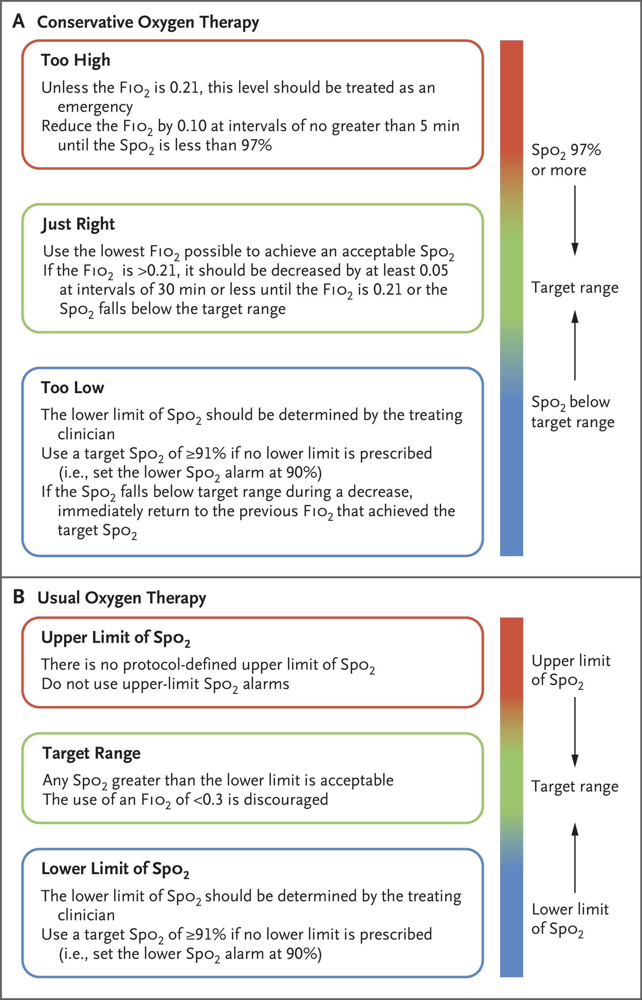
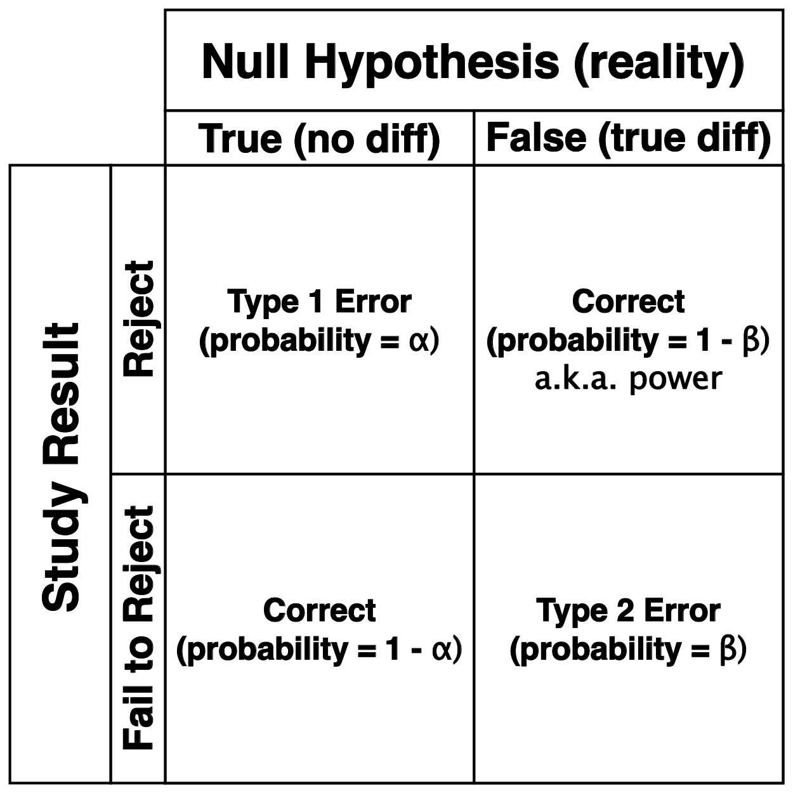
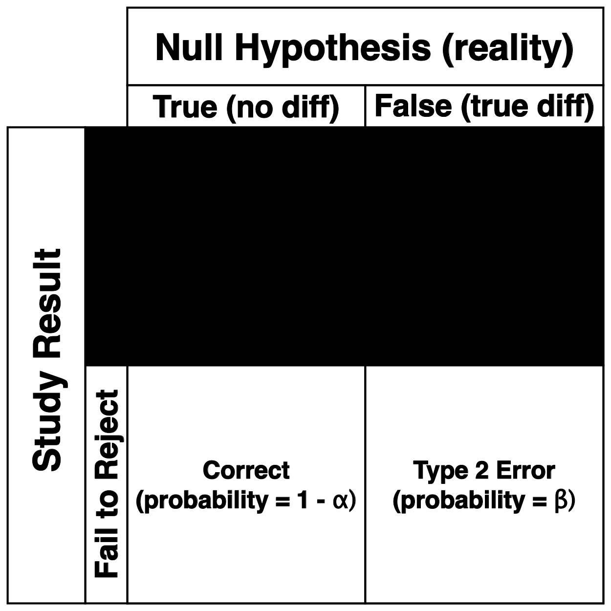
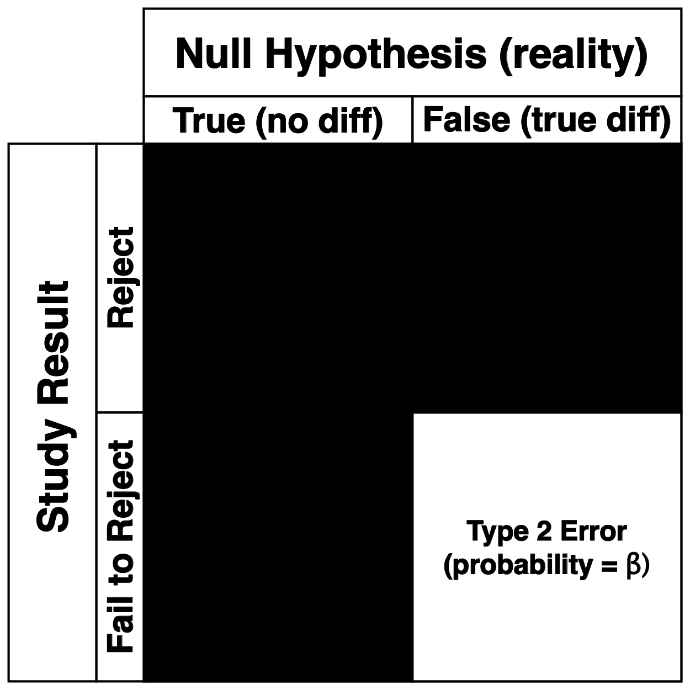

# Study Design

## Text study design
<style>
.reveal section img { background:none; border:none; box-shadow:none; }
</style>

<style type="text/css">
.reveal { font-size: 24px;}
.reveal h1 { font-size: 2.6em;}
.reveal h2 { font-size: 2.0em;}
</style>

- 1000 patients
  - greater than 18
  - less than 2 hours of ventilation
  - randomized to usual oxygen versus consevative oxygen

- interim analysis at 100 and 500 pts at 28 days

- no comercial support

- lower O$_2$ limit was $S_pO_2 = 90\%$ or $P_aO_2 = 60$mmHg
  
- conservative O$_2$ had upper limit alarm $S_pO_2 = 97\%$

- usual O$_2$ prohibited upper limit alarm

## Visual study design

{height=550px}

## Outcomes
- primary
  - ventilator free days from randomization to 28 days
  
- secondary
  - death at 90 and 180 days
  - employment at 180 days if previously employed
  - cognitive function and QoL at 180 days
  
## Statistics 
- power analysis -- estimated to be 90%
  - assumed vent-free days 16.4 +/- 11.3
  - 15% inflation and additional 80 pts for interim analysis
  - assummed difference 2.6 vent free days
  - two-sided hypothesis
  
- rank sum test #1
  - quantile regression on study site
  - complicated way of saying they ranked percentile rather than raw score per site
  
- rank sum test #2
  - quantile regression on site, age, sex and risk of death

##

<blockquote>
"We did not correct for multiple comparisons in the evaluation of secondary... outcomes."
</blockquote>

# Results

## Primary outcome

- no difference in ventilator free days at day 28
  - median 22.1 days in control
  - median 21.3 days in conservative
  - difference of -0.3 days (after adjustment for site)
  - weird way to report 

## Secondary outcome

- **Mortality was 34.5% at 180 days**

- in hypoxic-ischemic group
  - mortality 43% in conservative
  - mortality 59% in control
  
- not much else different

# Conclusion

## Some takeaways

- there was a real difference in oxygen use

- the control was probably a real control

- limiting oxygen was fine
  - no difference in vent-free days
  - no difference in mortality
  - no obvious differences in secondary outcomes
  - probably should use less of it 

- maybe it helped with HIE

- previous trials had compared liberal oxygen (rather than usual)

## Limitations

- could not be blinded, obviously

- some missing QoL and cognitive data

# Biggest problem with <br> this negative study?

## All about power

{height=550px}

## We failed to reject the null

{height=550px}

## What is the chance that we were wrong?

{height=550px}

## Depends on the difference; what about these?
```{r, message = F, echo = F}
library(tidyverse)
library(cowplot)
library(pwr)

a <- rnorm(n = 100, mean = 0.0)
b <- rnorm(n = 100, mean = 2)

p <- ggplot(tibble(x = c(a, b), y = c(rep('a', 100), rep('b', 100))),
            aes(x = x, color = y, fill = y)) +
  geom_density(alpha = 0.5) +
  xlim(-5, 7.5) +
  xlab('') +
  theme_minimal_grid()

show(p)
```

## Normally or t-distributed is easy

- mean difference in days 2.6; std dev is 11.3
- significance level 0.05; power (ie 1 - $\beta$) = 0.9
- they add 15% for inflation and 80 pts for interim

```{r, message = F, echo = T}
print(
  pwr.t.test(d = 2.6/11.3, sig.level = 0.05, power = 0.9)$n * 2 * 1.15 + 80
  )
```

notice the sample size

---

## What about these, gamma distributions?
```{r, message = F, echo = F}
a <- rgamma(100, shape = 1)
b <- rgamma(100, shape = 20) - 10

p <- ggplot(tibble(x = c(a, b), y = c(rep('a', 100), rep('b', 100))),
            aes(x = x, color = y, fill = y)) +
  geom_density(alpha = 0.5) +
  xlim(-2.5, 25) +
  xlab('') +
  theme_minimal_grid()

show(p)
```

## Not normally or t-distributed,<br>requires knowing the distribution<br>of the data to simulate a probability density

## They did not do this so power is actually unknown

## We have a negative study without<br>knowing the probability of finding<br>a negative result was by chance

# I'm done